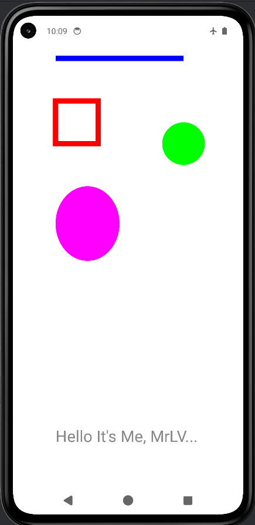

# Canvas App - Mobile Class Exercise 2

This is the second exercise for my mobile development class. It demonstrates how to use the Android `Canvas` and `Paint` classes to draw various 2D shapes programmatically on a custom Android `View`.

Main Files:-
1 - MainActivity: https://github.com/Lalit-Verma-Here/mobile_apps/blob/5cfec439c1d93306d7eef795c5295ad8c9c7c114/Canvas/app/src/main/java/com/mrlv/prac_1/MainActivity.java
2 - Exam.java: https://github.com/Lalit-Verma-Here/mobile_apps/blob/2ec0a56991af74f3c728923c58eb0a28789f48a5/Canvas/app/src/main/java/com/mrlv/prac_1/Exam.java

## Features
- Custom View implementation (`Exam.java`).
- Drawing basic graphics primitives on a Canvas:
  - **Line:** A blue line drawn across the screen using `drawLine()`.
  - **Rectangle:** A red stroked rectangle using `drawRect()`.
  - **Circle:** A green filled circle using `drawCircle()`.
  - **Oval:** A magenta oval using `drawOval()`.
  - **Text:** Custom text ("Hello It's Me, MrLV...") drawn using `drawText()`.

## Tech Stack
- **Platform:** Android
- **Language:** Java
- **Build System:** Gradle UI

## Project Structure
- `MainActivity.java`: The main entry point of the application. Instead of resolving a layout XML, it programmaticlly sets an instance of the `Exam` view as the screen's main content view.
- `Exam.java`: A custom subclass of `android.view.View` that overrides the `onDraw()` method to perform custom rendering operations utilizing `Canvas` and `Paint`.

## How to Run
1. Open the project directory (`Canvas`) in **Android Studio**.
2. Sync the project with Gradle files.
3. Build and run the app on an Android Emulator or a physical Android device.

## Application Preview

