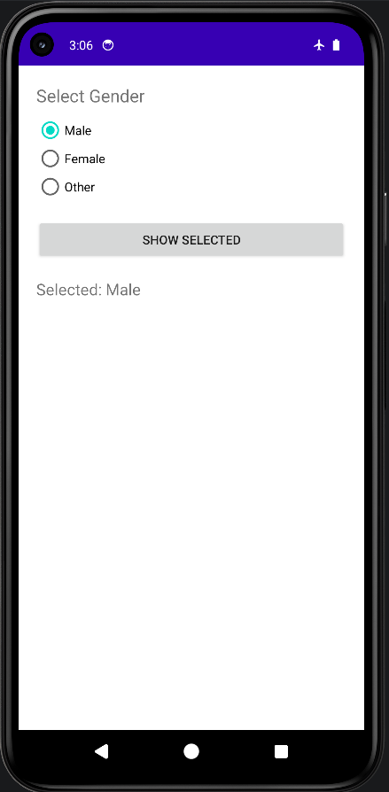

# Exercise 9: Gender Selection

## Overview
This is the 9th exercise for the mobile application class. This android application demonstrates the usage of RadioButtons or similar input controls to select a gender or option.

Main Files:
- [AndroidManifest.xml](./app/src/main/AndroidManifest.xml)
- [MainActivity.java](./app/src/main/java/com/example/exp_9/MainActivity.java)
- [activity_main.xml](./app/src/main/res/layout/activity_main.xml)

## Features
- Allows users to select options using UI elements.
- Handles user input events and updates the display accordingly.

## Tech Stack
- Android SDK
- Java
- XML for UI layout designs
- Gradle for build management

## Screenshots

Here are the screenshots demonstrating the application:

