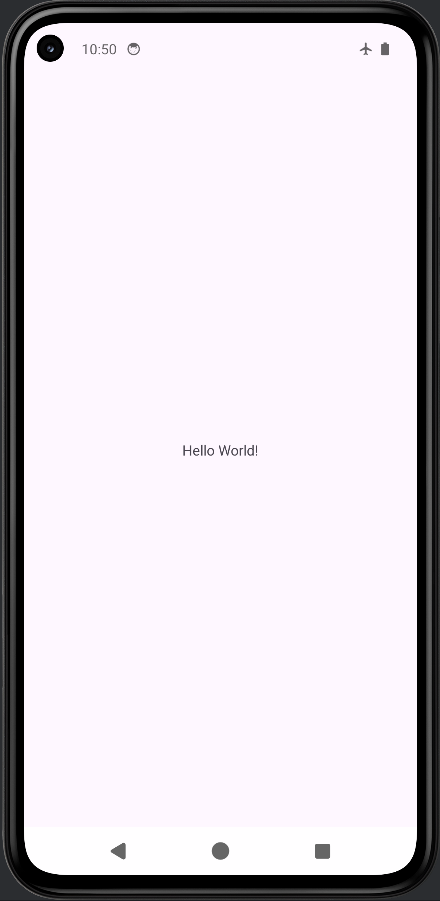

# HelloWorld - Mobile Application Class Exercise 1

This is the first programming exercise for the Mobile Application class. It is a simple "Hello World" Android application built using Kotlin.

## Overview

The application demonstrates the basic structure of an Android project and how to display a simple user interface containing a text message.

### Features
* Displays "Hello World!" on the center of the screen.
* Basic ConstraintLayout usage.
* Edge-to-edge display support.

## Project Structure
* **Language:** Kotlin
* **Main Activity:** `MainActivity.kt`
* **Layout:** `activity_main.xml`

## How to Run
1. Open the project in Android Studio.
2. Sync the project with Gradle files.
3. Build and run the `app` configuration on an Android emulator or a physical device connected via USB.

## Screenshot

