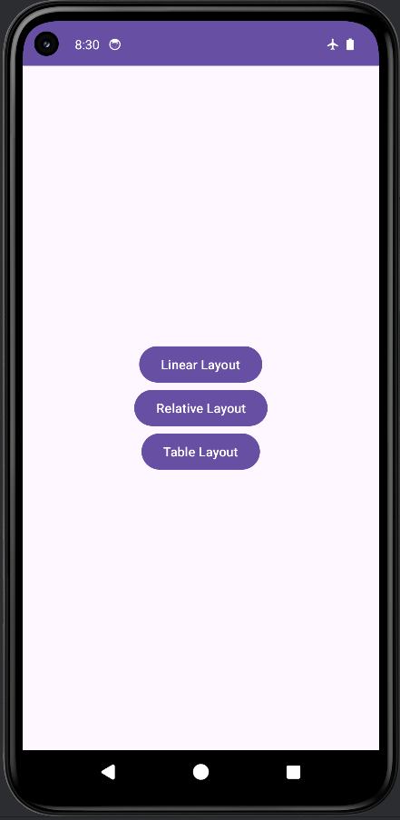
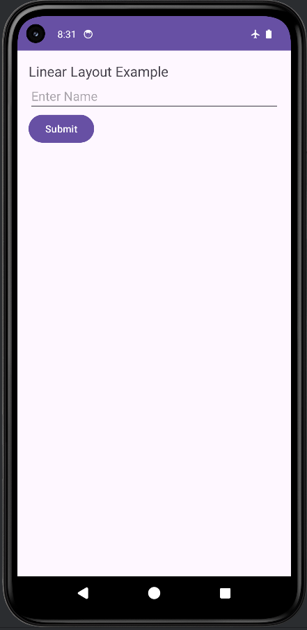
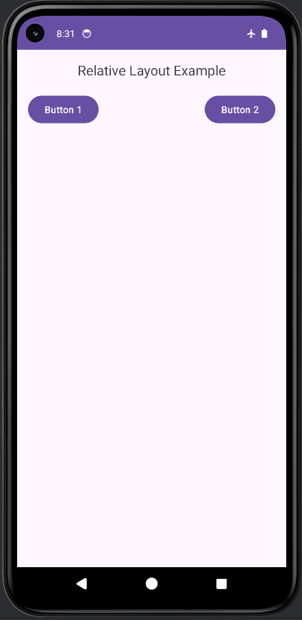
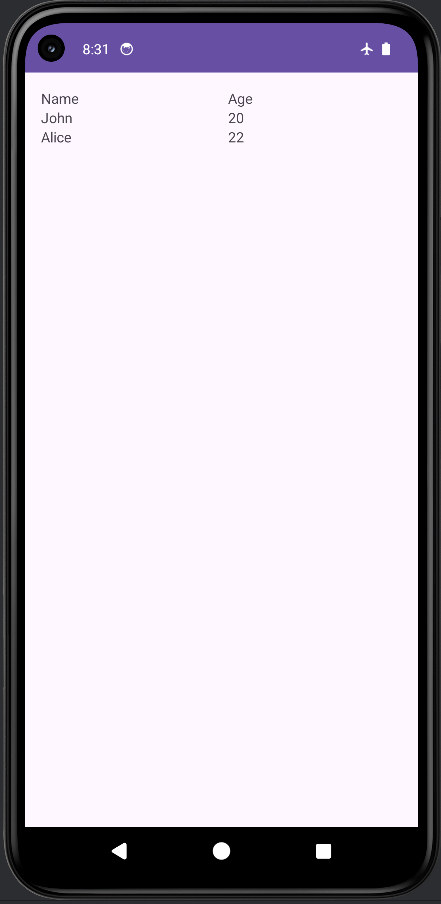

# Exercise 6: Android Layouts

## Overview
This is the 6th exercise for the mobile application class. This android application demonstrates the use of different fundamental Android layouts, including:
- **Linear Layout**: Arranges elements horizontally or vertically.
- **Relative Layout**: Arranges elements relative to each other or to their parent.
- **Table Layout**: Arranges elements into rows and columns.

The `MainActivity` acts as a navigation hub, providing buttons to launch three specialized activities, each showcasing one of the layout types.

## Features
- **Main Activity:** Contains navigation buttons to explore the different layout examples.
- **Linear Activity:** Demonstrates a simple `LinearLayout` arranging UI components linearly.
- **Relative Activity:** Demonstrates a `RelativeLayout` arranging UI components in relation to one another.
- **Table Activity:** Demonstrates a `TableLayout` where UI components are structured in a tabular grid format.

## Tech Stack
- Android SDK
- XML for UI layout designs
- Gradle for build management

## Screenshots

Here are the screenshots demonstrating the application:

