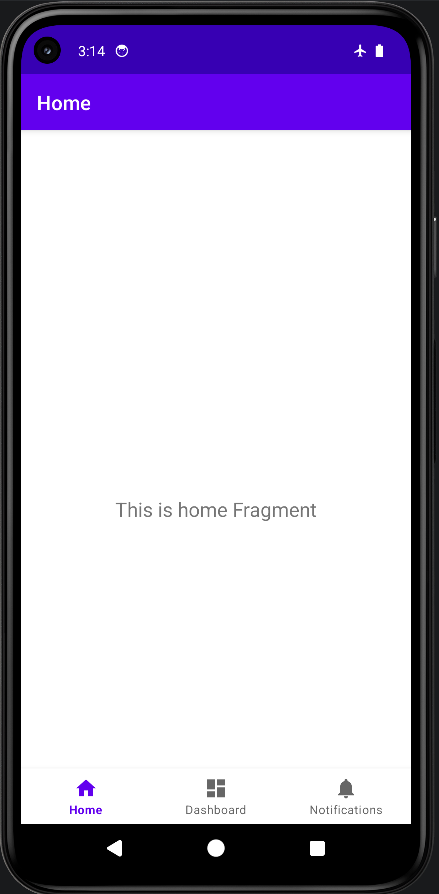

# Exercise 10: Bottom Navigation Menu

## Overview
This is the 10th exercise for the mobile application class. This android application demonstrates the implementation of a Bottom Navigation Menu using fragments.

Main Files:
- [AndroidManifest.xml](./app/src/main/AndroidManifest.xml)
- [MainActivity.kt](./app/src/main/java/com/example/myapplication/MainActivity.kt)
- [activity_main.xml](./app/src/main/res/layout/activity_main.xml)
- [bottom_nav_menu.xml](./app/src/main/res/menu/bottom_nav_menu.xml)
- [mobile_navigation.xml](./app/src/main/res/navigation/mobile_navigation.xml)

## Features
- Uses `BottomNavigationView` for main navigation.
- Demonstrates navigation between different fragments (Home, Dashboard, Notifications).
- Leverages the Android Jetpack Navigation component.

## Tech Stack
- Android SDK
- Kotlin
- XML for UI layout designs
- Gradle for build management

## Screenshots

Here are the screenshots demonstrating the application:

