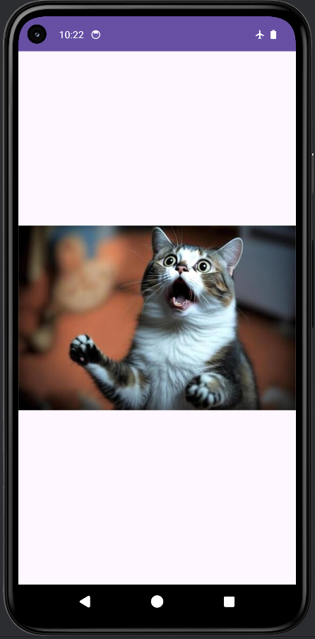
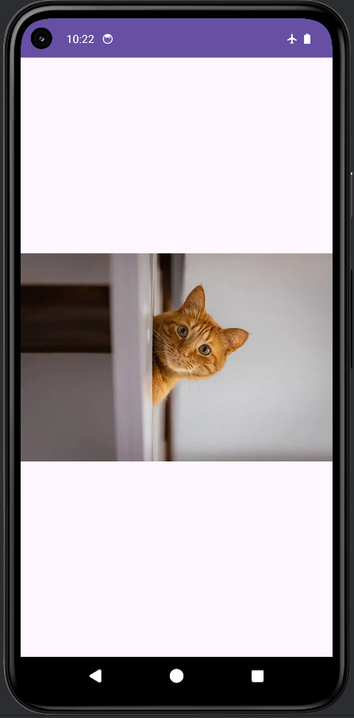

# Mobile Application Class - Exercise 3: Image Slideshow

## Description
This Android project represents the third exercise in the Mobile Application class. It is a simple, automated image slideshow application. The app cycles through a predefined set of images, automatically updating the displayed image every 3 seconds.

Main Files:-

1 - MainActivity: https://github.com/Lalit-Verma-Here/mobile_apps/blob/c1e50abe4c5f7d75d4b279082e60a671f9f53505/Pictures/app/src/main/java/com/mrlv/prac3/MainActivity.java

2- activity_main: https://github.com/Lalit-Verma-Here/mobile_apps/blob/c1e50abe4c5f7d75d4b279082e60a671f9f53505/Pictures/app/src/main/res/layout/activity_main.xml

## Features
- **Automated Slideshow:** Automatically transitions between multiple images without requiring any user interaction.
- **UI Thread Scheduling:** Utilizes `android.os.Handler` and `android.os.Looper` to schedule and execute image updates seamlessly on the main UI thread.
- **Lifecycle Management:** Properly manages resources by stopping the slideshow when the activity is destroyed, preventing memory leaks and unnecessary background processing.
- **Responsive Layout:** Uses a `ConstraintLayout` to ensure the `ImageView` scales and centers the images appropriately across different screen sizes.

## Technologies Used
- **Language:** Java
- **UI Layout:** XML (ConstraintLayout)
- **Key Components:** `AppCompatActivity`, `ImageView`, `Handler`, `Runnable`

## Screenshots

