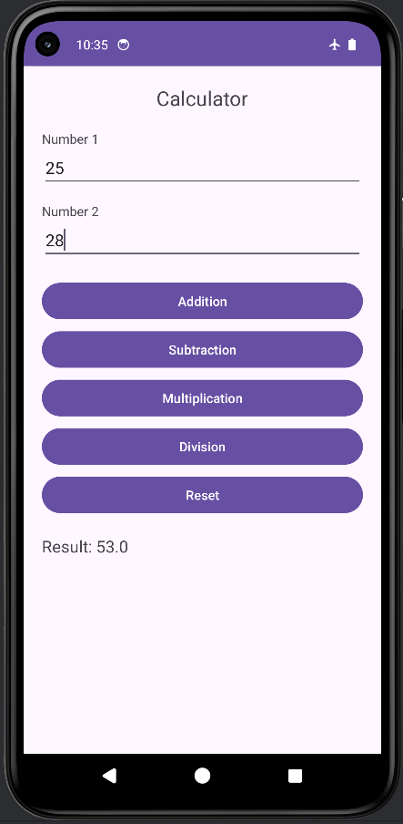
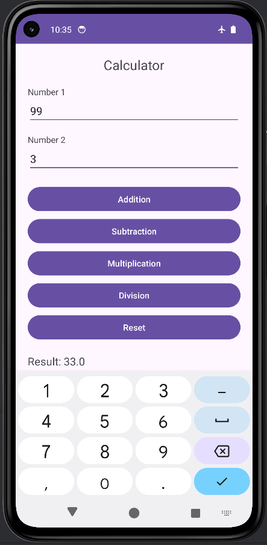

# Mobile Application Class - Exercise 4: Sum Calculator

## Description
This is an Android application developed as the fourth exercise for the Mobile Application class. It functions as a basic calculator that allows users to perform simple arithmetic operations on two input numbers.

Main Files:-

1- MainActivity: https://github.com/Lalit-Verma-Here/mobile_apps/blob/bd390dd850da499393aebeed16353c774fe4e3bb/SumCalculator/app/src/main/java/com/mrlv/app4/MainActivity.java

2 - activity_main: https://github.com/Lalit-Verma-Here/mobile_apps/blob/bd390dd850da499393aebeed16353c774fe4e3bb/SumCalculator/app/src/main/res/layout/activity_main.xml

## Features
- **Addition (+)**: Adds two numbers.
- **Subtraction (-)**: Subtracts the second number from the first.
- **Multiplication (*)**: Multiplies two numbers.
- **Division (/)**: Divides the first number by the second. Includes basic error handling for division by zero.
- **Reset**: Clears the input fields and the result display.
- **Input Validation**: Ensures that both input fields are filled before performing any calculation and shows an appropriate message if they are not.

## Technologies Used
- **Platform**: Android
- **Language**: Java
- **UI Framework**: Android SDK (XML Layouts)

## Screenshots

Here are some screenshots demonstrating the application's functionality:

### Screenshot 1

### Screenshot 2

### Screenshot 3

