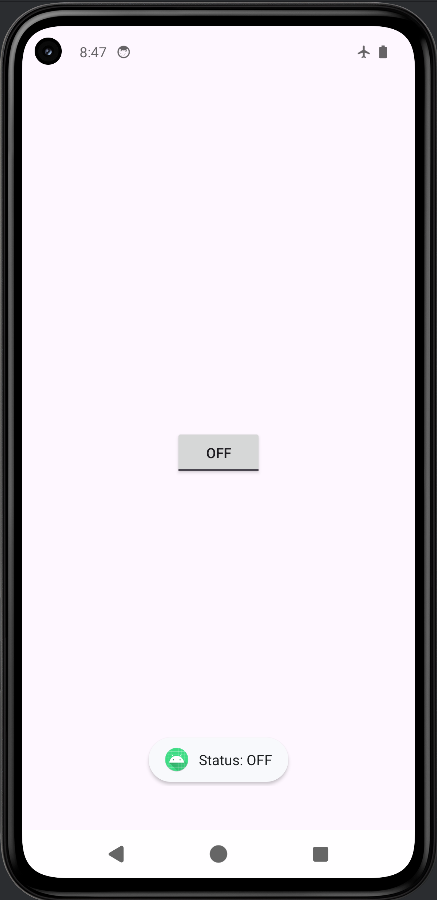

# ToggleButton - Mobile Application Class Exercise 5

This is the fifth programming exercise for the Mobile Application class. It is a simple Android application built using Java that demonstrates the use of a `ToggleButton`.

MainActivity.java: https://github.com/Lalit-Verma-Here/mobile_apps/blob/0cc8b3895fa85646b6a3552200742d68876c68cf/ToggleButton/app/src/main/java/com/mrlv/togglebutton/MainActivity.java

activity_main.xml: https://github.com/Lalit-Verma-Here/mobile_apps/blob/0cc8b3895fa85646b6a3552200742d68876c68cf/ToggleButton/app/src/main/res/layout/activity_main.xml

## Overview

The application demonstrates how to use a `ToggleButton` and attach an `OnCheckedChangeListener` to it to detect state changes and show a `Toast` notification.

### Features
* Utilizes a `ToggleButton` to switch between ON and OFF states.
* Displays a `Toast` message ("Status: ON" or "Status: OFF") when the button's state changes.
* Edge-to-edge display layout configuration support.

## Project Structure
* **Language:** Java
* **Main Activity:** `MainActivity.java`
* **Layout:** `activity_main.xml`

## How to Run
1. Open the project in Android Studio.
2. Sync the project with Gradle files.
3. Build and run the `app` configuration on an Android emulator or a physical device connected via USB.

## Screenshots

**Status OFF**

**Status ON**

